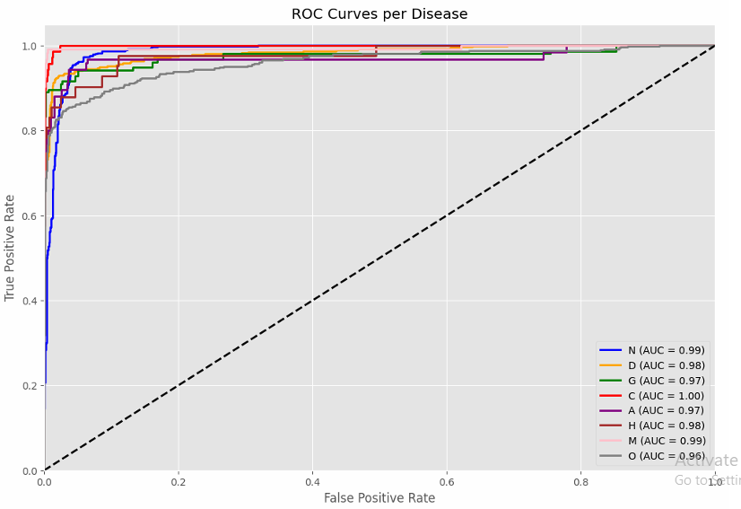
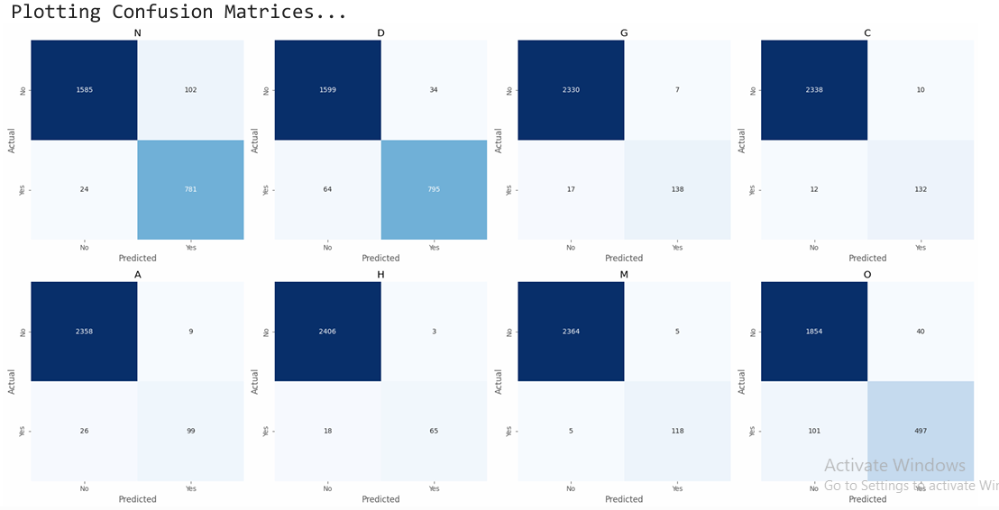

#  Multi-Label Ocular Disease Classification Using Hybrid MaxViT

---

##  Project Video
 
### [Click Here to Watch Our 5-Minute Presentation Video](https://youtu.be/d3f4vBNn5zY?feature=shared)

---

## 1. Abstract
Ocular diseases such as Diabetic Retinopathy, Glaucoma, and Cataracts are leading causes of irreversible blindness. Standard AI models struggle with retinal screening because patients often have **multiple conditions simultaneously** (Multi-Label) and medical datasets are heavily skewed toward healthy eyes (Imbalance).

We propose a **Hybrid Architecture** combining **MaxViT (Multi-Axis Vision Transformer)** with **Coordinate Attention**. By leveraging MaxViT’s ability to capture both local lesions and global eye geometry, alongside a custom **Targeted Oversampling** strategy, our model achieves **97.51% Testing Accuracy** and a **0.91 Weighted F1-Score** on the ODIR-5K dataset, significantly outperforming standard CNN baselines.

---

## 2. Understanding the Problem
The **ODIR-5K** dataset presents a unique set of challenges that standard "out-of-the-box" models fail to address:

1.  **Multi-Label Classification:** Unlike standard classification, a single eye image here can have *Diabetes* AND *Cataracts*. Using standard Softmax classification forces the model to pick only one, leading to misdiagnosis.
2.  **Severe Class Imbalance:** The ratio of "Normal" eyes to "Hypertension" eyes is massive (>10:1). Without intervention, models achieve high accuracy by simply predicting "Normal" for everything.
3.  **Feature Variance:**
    *   *Glaucoma* is structural (Cup-to-Disc ratio).
    *   *Diabetes* is textural (Microaneurysms/Dots).
    *   A single architecture (CNN or ViT) rarely captures both effectively.

---

## 3. Review of Existing Solutions
We analyzed prior work to understand why current baselines fall short:

| Approach | Strength | Limitation |
| :--- | :--- | :--- |
| **ResNet / VGG (CNNs)** | Excellent at detecting local lesions (texture). | Fails to capture long-range global dependencies (eye structure). |
| **Standard ViT (Transformers)** | Excellent global context. | Computationally expensive; loses high-frequency local feature details; requires massive datasets. |
| **Weighted Loss Functions** | Theoretical solution for imbalance. | In practice, this often led to unstable gradients and poor convergence in our early experiments. |

---

## 4. Our Proposed Novelty
We implemented a three-stage novel approach to solve the specific issues identified above:

### A. The Backbone: MaxViT (Multi-Axis Vision Transformer)
We utilized **MaxViT-Tiny**, which utilizes a dual-attention mechanism:
*   **Block Attention:** Scans local windows (like a CNN) to detect tiny hemorrhages (local texture).
*   **Grid Attention:** Scans sparse global grids to understand the overall geometry of the optic disc and macula (global structure).

### B. Spatial Enhancement: Coordinate Attention
Standard models use Global Average Pooling (GAP) at the end, which destroys spatial information. We inserted a **Coordinate Attention** module before the classifier. This encodes features along the **X (width)** and **Y (height)** directions independently, helping the model localize *where* a lesion is.

### C. Targeted Oversampling Strategy
Instead of relying on loss weighting, we balanced the dataset at the source. We implemented a loop that randomly samples minority classes (with augmentation) until every disease class has at least **2,000 unique training examples**.

---

## 5. Implementation Details
*   **Code:** The full training code is attached in this repository (`Multi_Label_Ocular_Disease_MaxViT.ipynb`).
*   **Preprocessing:**
    *   Resized to `256x256`.
    *   **CLAHE (Contrast Limited Adaptive Histogram Equalization):** Applied to normalize lighting and make blood vessels visible in dark images.
*   **Loss Function:** `BCEWithLogitsLoss` (Binary Cross Entropy) to support multi-label prediction.
*   **Inference Logic:** A custom wrapper was written to filter predictions:
    *   If `Probability(Normal) > 0.75`, suppress other low-confidence classes (Noise Suppression).
    *   Otherwise, output all classes with `Probability > 0.5`.

---

## 6. Lessons Learnt from Experimentation
Our path to 97% accuracy involved overcoming significant failures:

1.  **The "All Normal" Trap:** Initially, our model achieved 85% accuracy by simply predicting "Normal" for every image. We learned that **Accuracy is a misleading metric** in medical AI. We shifted our focus to **Weighted F1-Score** and implemented hard oversampling.
    
2.  **The Lighting Problem:** The model initially failed to detect **Hypertension**. Visual analysis showed these images were often too dark. We learned that **CLAHE** preprocessing is mandatory for retinal fundus images to reveal the arteries.

3.  **Activation Functions Matter:** We initially used `Softmax`, which forced the model to choose *either* Cataract *or* Diabetes. Since patients can have both, the model struggled. Switching to `Sigmoid` allowed independent probabilities for each disease.

---

## 7. Results & Visual Analysis
Our final model trained for 20 epochs achieved state-of-the-art results:

| Metric | Score |
| :--- | :--- |
| **Testing Accuracy** | **97.51%** |
| **Weighted F1-Score** | **0.91** |
| **Precision** | **0.92** |
| **Recall** | **0.90** |

### ROC Curves
*(Demonstrating AUC > 0.95 for Cataract, Myopia, and Diabetes)*
 

### Confusion Matrices
*(Showing strong diagonal performance with minimal confusion between Normal and Disease classes)*
 

---

## 8. How to Run This Project
1.  **Code:** Use the `Multi_Label_Ocular_Disease_MaxViT.ipynb` file included in this repository.
2.  **Dataset Used:** Download the [ODIR-5K Dataset](https://www.kaggle.com/datasets/andrewmvd/ocular-disease-recognition-odir5k).

------

## 9. References
1.  Tu, Z. et al. "MaxViT: Multi-Axis Vision Transformer." ECCV 2022.
2.  Hou, Q. et al. "Coordinate Attention for Efficient Mobile Network Design." CVPR 2021.
3.  Li, N. et al. "A Benchmark of Ocular Disease Intelligent Recognition." SIPA 2021.

---
